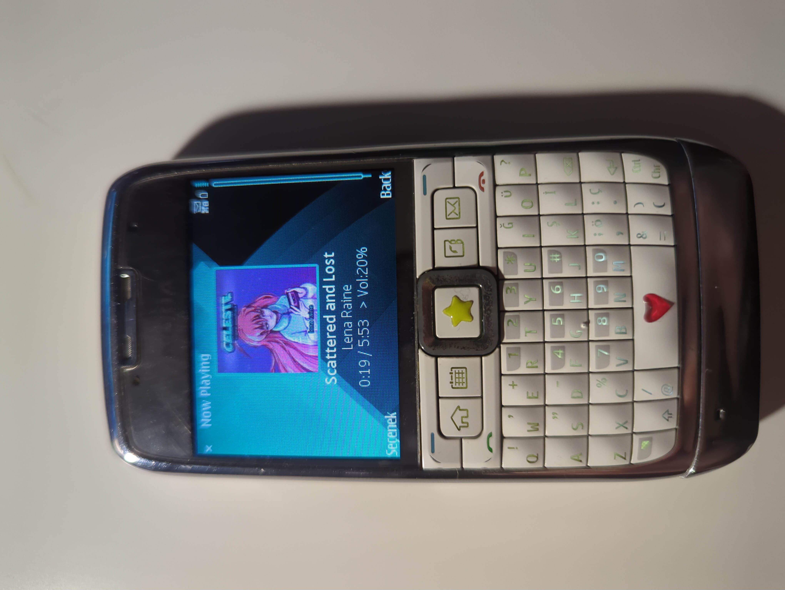

# J2ME Subsonic Client

A lightweight, J2ME Subsonic Client.  
This is a project i've developed instead of studying for my finals. :p  
It has basic music player functions. (Streaming, downloading, liking a song, search, transcoding)  
I've only tested it using Sun Java Wireless Toolkit Emulator and my Nokia e71 with my Navidrome instance.  
If you test it with other devices and Subsonic compatible servers please let me know.  
If you have any questions please feel free to ask via e-mail (edizteker5@gmail.com)  

I still don't know some stuff about j2me development so if anyone want to have a chat about this you can do via my e-mail.  

This project was possible with these sources:  
- https://github.com/ading2210/setup-j2me-sdk  
- https://retrospect.hackclub.com/j2me  
- https://github.com/gtrxAC/discord-j2me/tree/main/src/cc/nnproject/json  

(assets/2.jpg)(assets/3.jpg)(assets/4.jpg)

